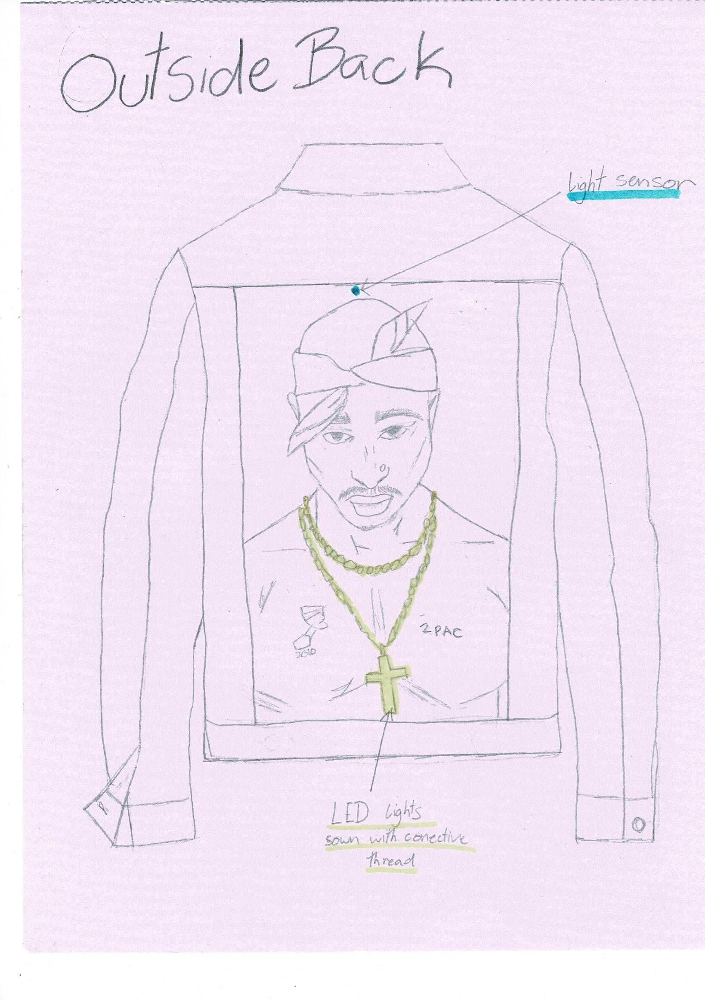
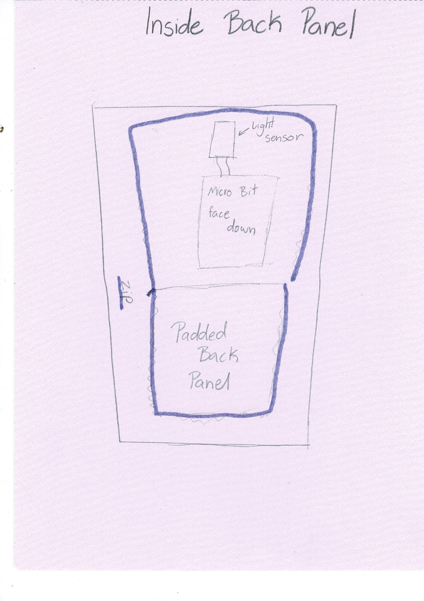
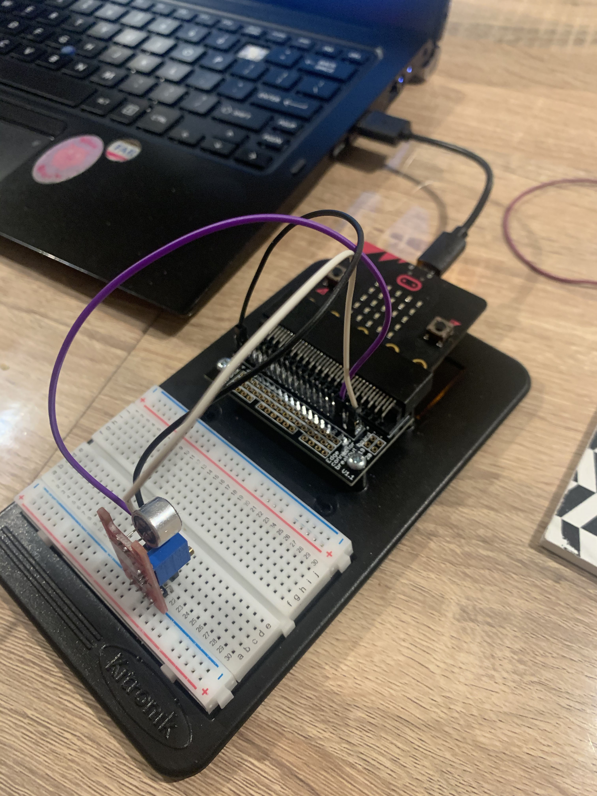

# 1701QCA Making Interaction - Assessment 2 workbook

You will use this workbook to keep track of your progress through the course and also as a process journal to document the making of your projects. The comments in italics throughout the template give suggestions about what to include. Feel free to delete those instructions when you have completed the sections.

When you have completed the template, submit the link to the GitHub Pages site for this repository as a link in Learning@Griffith. The link should be something like [https://qcainteractivemedia.github.io/1701QCA-Assessment2/](https://qcainteractivemedia.github.io/1701QCA-Assessment2/) where `qcainteractivemedia` is replaced with your GitHub username and `1701QCA-Assessment2` is replaced with whatever you called the repository this template is contained in when you set it up.

## Project working title ##
Denim Jacket with LED's that responds to sound

## Related projects ##
*Find about 6 related projects to the project you choose. A project might be related through  function, technology, materials, fabrication, concept, or code. Don't forget to place an image of the related project in the appropriate folder and insert the filename in the appropriate places below. Copy the markdown block of code below for each project you are showing.*

### Related project 1 ###
LED Technology at The Met Gala

https://medium.com/@harishpersad/led-technology-at-the-met-gala-cd610c729d22

This is Zendaya’s MET Gala look. It is a Cinderella dress designed by Law Roach that incorporates an LED solution for fabric colour changing in a daylight red carpet setting. This project is related to mine as I am also creating clothing with led lights. Instead of responding to light levels I am creating a jacket that responds to sound.  My aim is to create a more accessible version and incorporate sound.

### Related project 2 ###
Audiolux

[Audiolux](http://audioluxdevices.webflow.io/how-it-works)

This project is a device that allows users to translate sound to light! This plug-and-play stomp box analyses audio in real-time & generates music visualizations for smart LED pixels. This is similar to my project as I its LED’s that responds to sound. My aim is to incorporate something similar in a denim jacket.

### Related project 3 ###
Printer Farm Status Jacket 

[instructables] (https://www.instructables.com/id/3D-Printer-Status-Jacket/)

This project is a fun way to display the status of all of your machines, to ensure the printers keep printing! This build uses a Particle Photon for its IoT capabilities, and Adafruit NeoPixels. This is similar to my project as it is wearable LED’s and that is another form of wearable tec.

### Related project 4 ###
Trucker Jacket Levi’s 

[jacquard] (https://atap.google.com/jacquard/collaborations/levi-trucker/)

This project is a Iconic Levi’s Trucker jacket merges style with innovative Jacquard technology. Answer calls, play music, and take photos right from your sleeve. This is similar to my project as it is a jacket with technology embedded in it.

## Other research ##
[mashable] (https://mashable.com/2016/02/11/led-clothes/)

This source is an article on the future of LED clothes. The article talks about different designers that are incorporating LED’s into their clothing, and briefly talks about the process of make the clothing and how to works. This gave me some ideas on how I could do my project. For example, the article says many designers use silhouettes popular in street like oversized and minimal this not only helps the aesthetic value of the project it will also help to hide the Micro Bit. The article also reviews the clothing and highlights some flaws in the design. This shows me what to avoid doing. 

[howstuffworks] (https://electronics.howstuffworks.com/gadgets/high-tech-gadgets/fabric-display4.htm)

This article is similar to the previous one. This article goes more in-depth with the process of creating the clothing. This gave me inspiration on how I could do that. 

[YouTube](https://www.youtube.com/watch?v=6ZjLd2ifxhY)
[YouTube](https://www.youtube.com/watch?v=tPxFe_rETHA)
[YouTube](https://www.youtube.com/watch?v=guZJT_h2gP0)

the three video are tutorial on how to make sound and voice reactive LED’s using Arduino. Although this was made for thee Arduino, I could adapt it work with the micro bit.  These video helped me get an idea on how mine should work on the micro bit. The videos also helped me get an idea of the sound sensor and how to works.

[sparkfun] (https://invent.sparkfun.com/cwists/preview/2054x)

This is a project someone has done that incorporates LED’s into a cape using a micro bit. What I have taken from this article is how to incorporate the LED’s. They used Lilly Pad LED’s with conductive thread. 

[YouTube] (https://www.youtube.com/watch?v=FxvBVvBWh4I)

This video goes into detail on different sew able LED’s and wearable technology in general. What I took from this video was that Lilly Pad LED’s work really well for wearable LED’s. They are waterproof but can be a bit expensive. 

[wearabletutorials] (https://www.wearabletutorials.com/making_leds_sewable_for_wearables_conductive_thread/)
 
This article is about Making LED Lights Sewable for Wearables and Conductive Thread This article. This article will help me make the LED’s I have sewable into the jacket.

[osoyoo] (https://osoyoo.com/2018/09/17/micro-bit-lesson-using-the-sound-detection-sensor/)

This website showed me how to connect the Sound sensor to my micro bit and get it working it also showed a simple code I can use to test if it’s working.

### *Brief resource name/description* ###

*Provide a link, reference, or whatever is required for somebody else to find the resource. Then provide a few comments about what you have drawn from the resource.*

## Conceptual progress ##

### Design intent ###
The Design intent for my project is to create a jacket that has a design on the back panel that incorporates LED's that resound to sound.

### Design concept 1 ###
My first design concept is a soundboard. It would allow to people to record sound and then play and loop them. The soundboard would have laptop connectivity allowing you to save the beat you have made. The soundboard would have a strip going down the centre and would come with a series to sticks with different coatings. Some have a thinner coating producing a different sound then one with a thick coting.

### Design concept 2 ###
My second design concept is a hat that moves to ward sound. There would be little spikes around the brim of the Hat that move toward where the sound in coming from. There would be a two sensors one on each side of the hat.

### Final design concept ###
My final design concept is to create a jacket that has a design on the back panel that incorporates LED's that resound to sound. On the Back panel of the jacket there will be a painting to Tupac Shakur with LED’s sew to his chain. The LED’s will be sown onto the jacket using connective thread, the LED’s will be connected to each other and back to the micro bit. The end of the sound sensor will be exposed on the top, centre of the back panel of the jacket to pick up sound. The micro bit and all the wiring will be on the inside of the jacket. There will be a padded panel over top of the micro bit to enclosed it into the jacket and to improve the comfortability. This panel will also me removable so the micro bit can be taken out. 

### Interaction flowchart ###
*Draw a draft flowchart of what you anticipate the interaction process in your project to be. Make sure you think about all the stages of interaction step-by-step. Also make sure that you consider actions a user might take that aren't what you intend in an ideal use case. Insert an image of it below. It might just be a photo of a hand-drawn sketch, not a carefully drawn digital diagram. It just needs to be legible.*

## Physical experimentation documentation ##

Week 5
This week we set up groups and discussions boards. I put my area of interest as music, particularly Hip Hop and R&B. I also responded to other people’s areas of interest. 
Week 6
In the Discussion board I up my area of interest as music. I got a suggestion form Cheuk Fai Mak it was “maybe you can make some sick beat that involves people interaction like everyone can modify it and come up with a really good one =D”. I really like this idea I am going to try make a soundboard that allows people to record sound and turn it into a beat. 
Easter Break
I did some research into making a soundboard with the micro bit. I would need to find a speaker to use. In my previous project used earphone speakers but you can’t hear it unless you put it in your ears. I want to incorporate and eternal speaker. I also need to find a way to record the sound. I can use buttons to create the soundboard and I can but everything in a box made of plywood to make it look presentable. I had another idea; it was to make a jacket with lights in the back that react to sound or a hat that moves toward sound but in not sure how that would work. 
Week 7
During tutorial
During the tutorial I talked to Ged about my ideas. He pointed out it need to be something unique so I could have an interesting way of interreacting with the sound bored like physically moving it to get different sounds. I am now thing if doing the jacket idea. I need to do some research into sewable LED lights. I also need to look into sound sensors. 
After Tutorial 
I did some more research into sewable LED lights I found a brand called Lilly Pad LED’s that are really good. They are easy to use and are waterproof the only issue is that they are expensive, and I won’t be able to get them because of the corona virus it will take too long to get here. I did some more research and found that you can bent the normal LED’s to sew them. I need to buy some more LED’s and find connective thread. 

I found it difficult to find any micro bit project with a sound sensor all I could find was Arduino. I emailed Ged to see if I could change the project from a sound sensor to a light sensor. The main issue with this was that it doesn’t fit with my area of interest. I sent some Arduino project I wanted to create on the micro bit and he sent be some links. After looking at them I had an idea of what I had to do. I sketched out a design of what I wanted it to look like and how it would work.

I bought a sound sensor it was hard to find. I played with it a bit, I didn’t get it working but I know what I need to do to fix it.

## Design process discussion ##
*Discuss your process in getting to this point, particularly with reference to aspects of the Double Diamond design methodology or other relevant design process.*

## Next steps ##
*Write a list or provide other information about your plan to move the project forward to be ready to present by video and documentation in week 12 of the course.*
